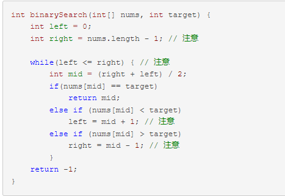

# **二分搜索算法**  
## 简介  
今天我们来介绍**二分搜索算法**。二分搜索算法也叫*折半查找法*，它充分运用了元素之间的**次序关系**，采用**分治策略**，可在最坏的情况下用O(log n)完成搜索任务。  
## 算法要求
* 必须采用**线性存储结构**  
* 必须按关键字大小**有序排序**
## 基本思想
    二分搜索算法的基本思想是：假设数组按升序排序，将n个元素分成个数大致相同的两半，取a[n/2]与欲查找的x作比较。  
1.如果x=a[n/2]则找到x，算法终止；  
2.如果x<a[n/2]，则我们只要在数组a的左半部继续搜索x；  
3.如果x>a[n/2]，则我们只要在数组a的右 半部继续搜索x。
## 基本的二分搜索代码
  
搜索一个数，如果存在，返回其索引，否则返回 -1。  
## 总结
想学习更多关于二分搜索算法的相关知识，可以参考[这个博客](https://blog.csdn.net/weixin_43784305/article/details/106816995)